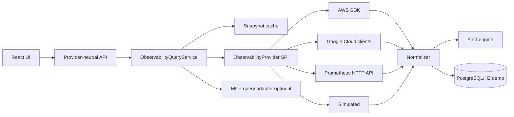

# Arquitectura propuesta

## Principio

Mantener el monolito modular actual. La observabilidad es un módulo interno, no un nuevo
microservicio.

## Paquetes backend sugeridos

```text
com.scalecanvas.observability
├── api
│   ├── ObservabilityController
│   ├── ProviderConnectionController
│   └── AlertController
├── application
│   ├── ObservabilityQueryService
│   ├── ProviderConnectionService
│   ├── SnapshotAssembler
│   ├── MetricNormalizationService
│   ├── AlertEvaluationService
│   └── TopologyResolutionService
├── domain
│   ├── ProviderConnection
│   ├── ObservedResource
│   ├── ResourceRelation
│   ├── MetricSample
│   ├── ResourceCapacity
│   ├── DimensionSnapshot
│   ├── ObservabilitySnapshot
│   ├── AlertRule
│   └── AlertInstance
├── provider
│   ├── spi
│   │   ├── ObservabilityProvider
│   │   ├── ResourceDiscoveryPort
│   │   ├── MetricQueryPort
│   │   └── AlarmQueryPort
│   ├── simulated
│   ├── aws
│   ├── gcp
│   ├── prometheus
│   └── otel
└── infrastructure
    ├── persistence
    ├── scheduling
    └── secrets
```

## Flujo



## Vistas

- Escena 3D con `three` + `@react-three/fiber` + `@react-three/drei`.
- Caja exterior con cotas transparentes por dimensión.
- Columnas separadas CPU/GPU/memoria/almacenamiento cuando haya datos.
- Fallback 2D con ECharts si WebGL no está disponible.
- HUD/labels acotados a máximo 20 etiquetas visibles.

## Frontend

- consumir snapshot provider-neutral desde backend;
- transformar a `SceneModel` local;
- no consultar AWS/GCP directamente;
- no recalcular reglas;
- renderizar y permitir selección, filtros y leyenda simple.

## Polling

Primera versión:

- manual refresh;
- polling configurable, mínimo recomendado 30 segundos;
- timeout por proveedor;
- cache de último snapshot válido;
- backoff ante throttling;
- estado `STALE` si el último valor supera `staleAfter`.

No implementar scheduler distribuido durante el MVP.

## Persistencia

Persistir:

- conexiones sin secretos;
- inventario normalizado;
- relaciones;
- reglas;
- alertas;
- snapshots resumidos o samples seleccionados.

No replicar indefinidamente todas las series cloud.
